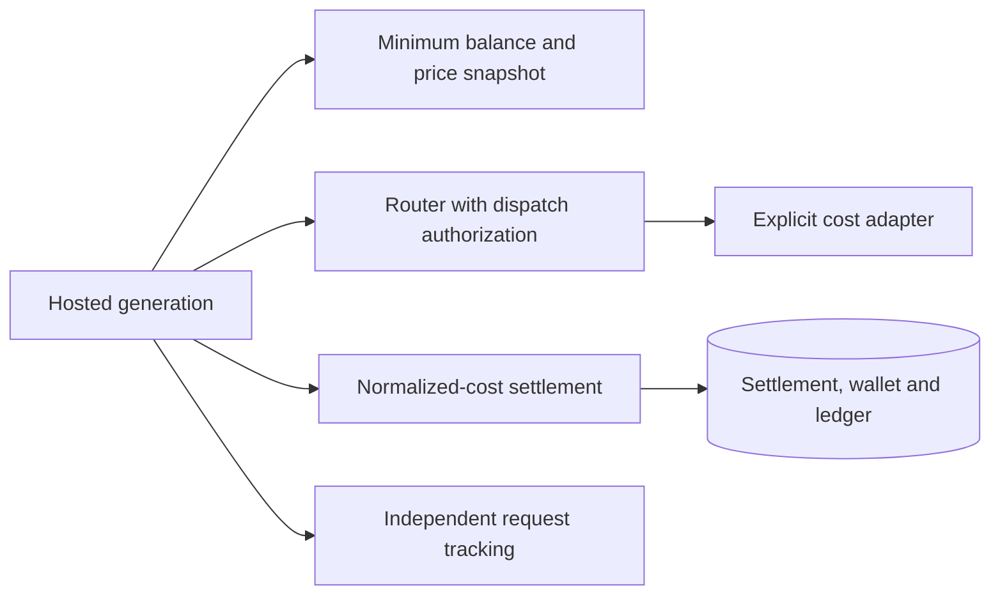
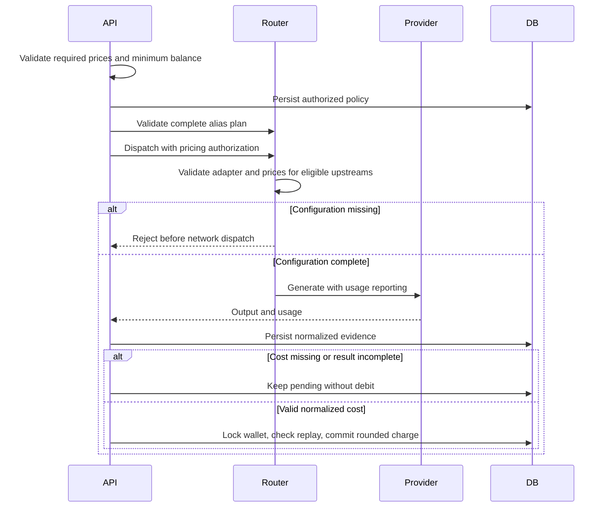

# Default normalized-cost LLM settlement

Date: 2026-09-27
Status: accepted

## Decision and scope

Request tracking is already merged into main. This PR adds only billing migration 0027.
Every hosted Chat Completions and Responses call uses normalized-cost settlement.
There is no optional cost-billing path and no LLM token-rate or per-request fallback.

## Requirements

| Rule | Implementation boundary |
| --- | --- |
| Default cost settlement | Hosted generation routes always save and settle a cost receipt |
| Missing adapter or price | Validate the captured pricing policy and every eligible upstream before dispatch; reject configuration errors |
| Missing returned cost | Keep the receipt pending; never infer cost from the old Flux token rate |
| Minimum callable balance | LLM_MINIMUM_BALANCE is separate from the actual charge; default five Flux preserves the previous admission threshold |
| Explicit price-table adapter | A supported future adapter may produce normalized USD cost from a versioned model price table and measured usage |
| Keep speech charging | Preserve the shared debit primitive and TTS/ASR metering; remove only LLM fixed-rate selection |

No sale price defaults are supplied. LLM_COST_BILLING is now required pricing configuration, not a feature gate.
All eligible upstreams of a router candidate must have a supported adapter and price.
A configuration failure stops alias fallback; it must not become a hidden switch to another charging policy.
The captured policy is reused for every local dispatch and later reconciliation.

## Architecture





Affected files:

```text
server/apps/api/
  src/services/adapters/llm/cost.ts
  src/services/adapters/config-kv/definitions.ts
  src/services/domain/billing/
  src/services/domain/llm-router/{router,types}.ts
  src/routes/openai/v1/{middlewares/billing,model-routing,operations}/
  src/schemas/{llm-request-settlement,flux,flux-transaction}.ts
  drizzle/0027_llm_cost_settlement.sql
```

## Cost adapter contract

Adapters produce USD cost, a cost source, generation correlation and bounded supporting usage.
The implemented OpenRouter adapter uses provider-reported cost and rejects unsupported BYOK accounting.
A future model-price-table adapter is a first-class pricing mode, not recovery from a missing provider receipt.
It must validate the requested model and complete rate dimensions before dispatch, retain its price-table version,
and calculate cost from measured usage with explicit cache and reasoning rules. Missing dimensions remain pending.
This change does not implement or populate a model price table.

## Persistence and compatibility

Migration 0027 creates non-concurrent indexes. An existing-ledger deployment needs a release-window assessment.
Missing or invalid cost returns after the durable receipt transaction, without a second wallet lock.
An already settled receipt returns under the first wallet lock, without another transaction or debit.
Successful settlement retains its charged cost snapshot in the same transaction as the wallet and ledger update.

Validate billing for every eligible upstream in the complete alias plan before dispatching its first candidate.
Keep dispatch-time validation to reject configuration changes between plan validation and a later attempt.
The router owns candidate selection and preflight validation. Protocol operations supply the authorized billing policy.

Persist request tracking before billing intake. If routing exits without a key dispatch,
close the unresolved intake as cancelled/not_dispatched instead of leaving false pending work.
An attempted upstream call remains pending when its outcome or cost is unknown.
Zero charges finalize settlement without a debit ledger row. Count underfunded settlements once after commit.
Preserve the first generation ID when later Chat frames disagree, and keep that receipt pending.

Settlement uses requestedFlux and chargedFlux for the requested and charged amounts.
The charged amount is a result snapshot committed with its ledger entry, not a second debit authority.
The ledger owns actual balance changes; settlement owns normalized cost, costSource, pricing and sanitized providerUsage.
Do not duplicate pricing and provider cost into ledger metadata, or copy full diagnostic observations into settlement.
No row schemaVersion or nested evidence version is needed for this single-format settlement schema.
The request-log schemaVersion field remains unchanged. It is a diagnostic contract, not settlement authority. The Flux usage ADR removes the request-log fluxConsumed field.

Apply tracking migration 0026 before billing migration 0027. These replace unpublished PR drafts, not already-applied draft migrations.
Settlement owns price snapshots and durable evidence. Logs do not query or update settlement storage.
Save pending evidence before charging. Commit wallet, ledger and settled state under the wallet lock.
Settled replay cannot charge twice. Preserve original provider, generation ID and price snapshot.
Each request charges ceil(costUsd × fluxPerUsd × multiplier) in whole Flux.
Round once, after multiplication, using decimal arithmetic to avoid floating-point boundary overcharges.
An explicit zero cost stays zero. Missing cost stays pending. No fractional balance carries between requests.
Remove the unmerged draft remainder fields from migration 0027; do not add another migration.
Speech metering and its Redis debt behavior remain unchanged.
LLM deployments without supported adapters and configured prices now reject requests intentionally.
LLM_MINIMUM_BALANCE is an admission threshold, not a reservation or fixed charge.
Old FLUX_PER_REQUEST and FLUX_PER_1K_TOKENS values no longer affect hosted LLM requests.

## Non-goals and verification

No production price configuration, deployment, automatic reconciliation worker or model-price-table implementation.
Test missing configuration/adapter before dispatch, default cost settlement, zero versus absent cost,
minimum-balance independence, fallback dispatch validation, interrupted streams, replay and speech-meter regressions.
Verify independent per-request ceiling, exact decimal boundaries, tiny positive costs, concurrent replay and transaction rollback.
Apply both migrations locally. Run focused tests, workspace typecheck and lint.
