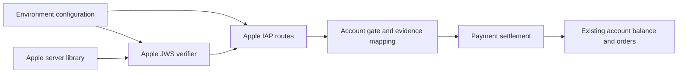
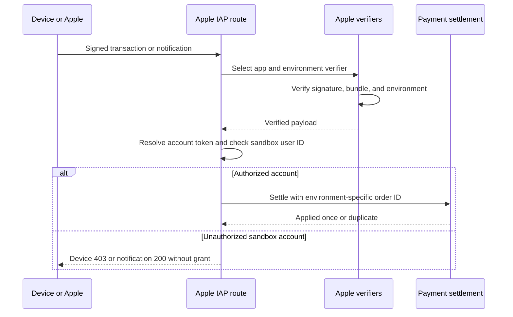

# Apple IAP sandbox accounts

Status: accepted. The requester confirmed dedicated test accounts.

## Decision

Keep `APPLE_IAP_ENV=production` on the shared API. Add an optional
`APPLE_IAP_SANDBOX_USER_IDS` list of exact internal user IDs. An empty list
keeps production verification unchanged. A nonempty list enables a second
Apple Sandbox verifier. Unverified bundle and environment claims select a verifier.
Each verifier retains Apple's signature and bundle checks. Xcode verification
is never a fallback on the production API.

After verification, both device submissions and charge notifications check the
resolved account against the list before settlement. An unlisted device user
gets 403 and keeps the transaction for a later retry. An unlisted notification
gets 200 without a grant. The account token must still belong to the user.

Sandbox orders use `sandbox:<bundleId>:<transactionId>` as their processor order
ID. Production IDs stay unchanged. Both delivery paths use the same key.
The notification envelope and inner transaction must have the same bundle and
environment.

## Scope and non-goals

This is account-level access control, not a second wallet or database.
Sandbox Flux enters the existing balance of a dedicated test account and can
consume real provider resources. Operators must use new, dedicated accounts,
keep them separate from normal accounts, and remove access after testing.
The deployment owner confirmed that there are no historical Sandbox orders
and no old Sandbox writers during rollout. New Sandbox purchases use the
namespaced order ID from their first settlement. The existing unique index
on `(processor, processor_order_id)` prevents duplicate grants, including
concurrent device and notification deliveries. No schema migration or
historical order compatibility is required for this rollout.

This change does not deploy services, configure App Store Connect, implement
refunds, create test accounts, or publish an iOS build. General TestFlight
access and App Review account provisioning need separate operational decisions.

## Dependencies and affected files



```text
server/apps/api/
  src/libs/env.ts                         # Parse the user allowlist
  src/app.ts                              # Wire verifier and route policy
  src/routes/apple-iap/verifier.ts        # Verified sandbox routing
  src/routes/apple-iap/evidence.ts        # Account gate and order identity
  src/routes/apple-iap/index.ts           # Pass account policy
  src/routes/apple-iap/operations/        # Device and notification gates
  src/routes/apple-iap/*.test.ts          # Verification and settlement tests
  src/libs/tests/env.test.ts              # Configuration defaults
  README.md                              # Deployment and test procedure
```



## Test plan

- Reproduce sandbox settlement for an unlisted user before the fix.
- Cover both device and notification gates, token ownership, and envelope mismatch.
- Cover environment routing, disabled Sandbox, invalid signatures, and Xcode rejection.
- Cover shared device/notification order identity and production ID preservation.
- Run payment core duplicate-settlement tests, API typecheck, and repository final checks.
- After deployment, use a new allowlisted account and a new iOS build for real sandbox purchases.
