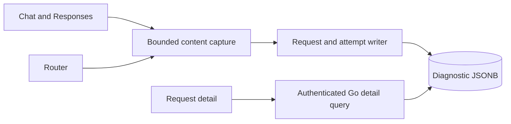
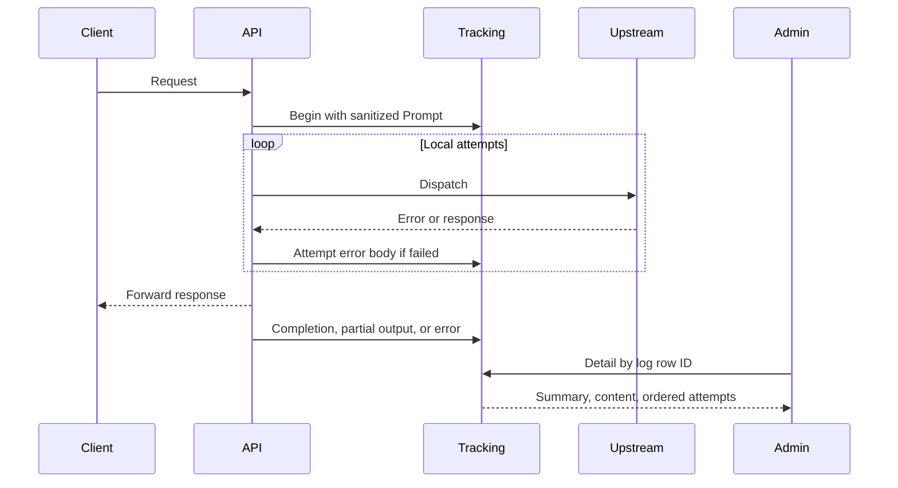

# LLM request content

Date: 2026-09-27
Status: accepted

## Decision

Store diagnostic Prompt, Completion, and error content with request tracking.
Keep text, tool calls, reasoning, and other JSON fields. Replace inline media
bytes with metadata. Do not fetch remote media URLs. Never capture HTTP headers.
Surface attribution, Activity analytics, and billing changes are out of scope.

Prompt is the accepted request body before gateway routing. Completion is the
upstream JSON response or ordered SSE data events, including partial output.
It is not proof that the client received every byte. Each failed local attempt
keeps its error body, even when another attempt succeeds. Transport errors have
a message rather than an invented upstream body.

Use nullable JSONB columns on request and attempt rows. An envelope contains
format, text, state, and omittedMedia. Missing historical content stays null.
The writer bounds each envelope to 8 MiB of UTF-8 text and marks truncation.
SSE stores complete event records up to the limit, not an invalid JSON fragment.
Interrupted streams retain captured events with a partial state.
Content shares diagnostic retention. This increment adds no retention scheduler
or automatic historical backfill. Content is not settlement evidence.

Only the authenticated Go Admin detail API exposes content. Lists select summary
columns. The owner-facing AIRI DTO continues to exclude content and credentials.
Final diagnostic writes keep the existing best-effort policy. A storage failure
is logged without including the content, and does not resubmit upstream work.

## Architecture



```text
server/apps/api/
  src/services/domain/request-content.ts
  src/services/domain/{generation-observation,request-log}.ts
  src/services/domain/llm-router/{attempt,router}.ts
  src/routes/openai/v1/operations/{chat-completions,responses}/index.ts
  src/schemas/llm-request-{log,attempt}.ts
  drizzle/0029_llm_request_content.sql
```



## Verification and rollout

Test JSON and SSE capture, tool/reasoning preservation, media omission, bounded
capture, malformed bodies, failed attempts, cancellation, and historical nulls.
Verify admin-only detail reads and unchanged lightweight lists. Deploy the AIRI
migration and writer before the Go reader, then deploy the dashboard.
No live migration or deployment is authorized by this implementation task.
