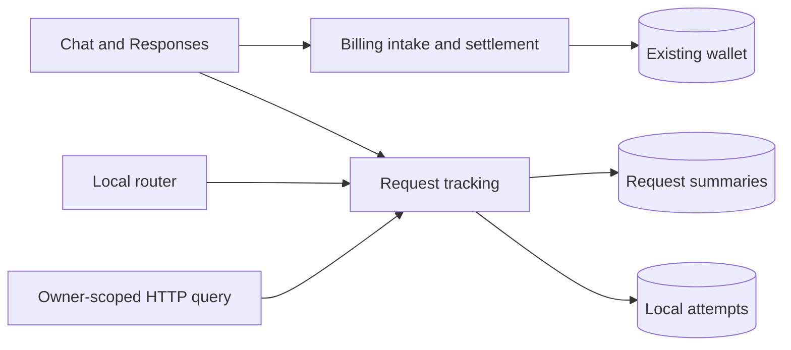
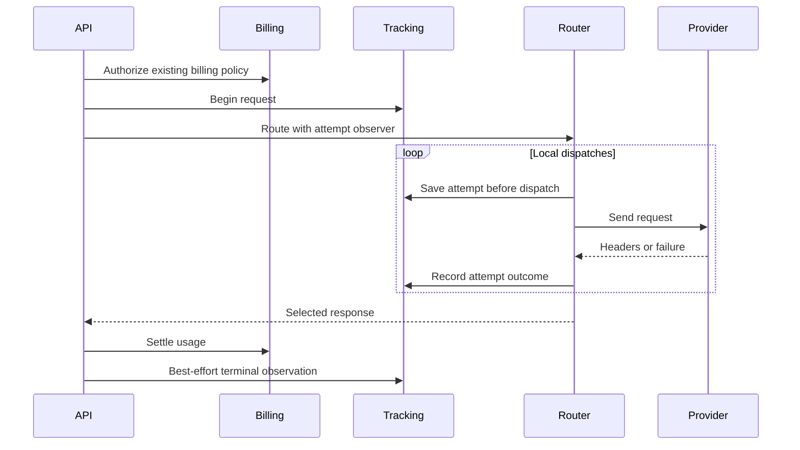

# Extensible LLM request tracking

Date: 2026-09-27
Status: accepted

## Decision and scope

Split diagnostic tracking from provider-cost settlement.
This change targets main. The billing PR depends on this tracking foundation.
Tracking owns the shared observation contract and usage extraction, not pricing or wallet mutation.
It neither imports nor queries settlement storage. Charged Flux in diagnostics is observational, not an accounting source of truth.

## Data ownership

- `llm_request_log`: one summary per user and request ID, nullable correlation for historical rows, request lifecycle, selected models, usage, timing and dimensions.
- `llm_request_attempt`: one local dispatch per request and sequence, route/credential references, gateway, status and provider evidence.
- `flux_transaction` and `user_flux`: existing ledger and wallet, unchanged here.
- Settlement storage belongs to the later billing PR, not this migration.

No cascading foreign key joins diagnostic retention to accounting retention.
Deleting diagnostic rows cannot remove evidence or permit a settled request to charge twice.
Versioned, bounded JSON observations keep new gateway fields extensible. Frequently queried fields have dedicated columns.
Unknown upstream facts remain null. Only dispatches observed by this router become attempts; hidden gateway retries are not invented.

## Architecture





Affected files:

```text
server/apps/api/
  src/app.ts
  src/routes/llm-requests/index.ts
  src/routes/openai/v1/{model-routing,operations}/
  src/services/domain/request-log.ts
  src/services/domain/llm-router/{attempt,router,types}.ts
  src/schemas/{llm-request-log,llm-request-attempt}.ts
  drizzle/0026_llm_request_tracking.sql
```

## Lifecycle and failures

Request states move from running to completed, failed, cancelled or interrupted when the request path observes an outcome.
Attempts start as running, may receive headers, and end on failure or the selected request's terminal observation.
The explicit stale-recovery operation marks running observations unknown without inventing end times, usage or cost.
It does not resubmit requests or mutate settlements. There is no recovery scheduler in this change.
Request/attempt persistence is awaited before dispatch. Tracking failure stops dispatch rather than running an untracked retry.
The later billing PR adds its own intake. Tracking does not create pending accounting rows.
Final diagnostic writes remain best effort and do not roll back completed settlement.

## Query boundary

Authenticated owner-scoped APIs expose `/api/v1/llm-requests` and `/api/v1/llm-requests/:requestId`.
Every request and attempt query includes user ownership. This API does not expose settlement data.
DTOs omit raw evidence, credential references and internal price snapshots.
The list uses bounded offset pagination. No admin cross-user API or Activity UI is included.

## Rollout and non-goals

Merge this PR first. The billing PR adds its separate 0027 migration afterward.
This PR supplies only 0026 tracking migration. Main's existing 0025 stays unchanged.
Historical rows remain readable with null new dimensions. Do not fabricate historical correlation or provider facts.
This is not an upgrade path from the earlier unpublished combined migration draft.
This PR preserves main's billing behavior. The dependent billing PR removes the old LLM rate policy.
No full prompt/completion bodies, automatic gateway lookup, independent gateway process, retention job or dashboard is added.
OpenRouter and other gateways can gain adapters and metadata without changing the billing boundary.

## Verification plan

Client input failures return 400. Request outcome follows the delivered status,
including malformed upstream JSON and settlement rejection; attempts retain their
upstream header status. Alias routing counters cover all candidates. Responses
preserves the same interaction dimensions as Chat Completions.

- Request and attempt lifecycle, local retry outcomes and ownership isolation.
- Safe query DTOs, nullable history, bounded and sanitized provider evidence.
- Diagnostic writes and retention never change wallet or ledger state.
- Tracking compiles and runs without settlement storage.
- Apply both migrations in order, preserve historical rows and settled accounting.
- Real HTTP routes with PGlite, billing regression suite, workspace typecheck and lint.
- Live provider traffic and production deployment remain unverified.
