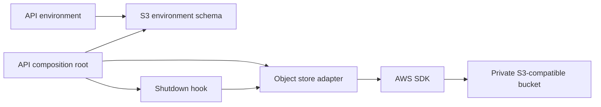
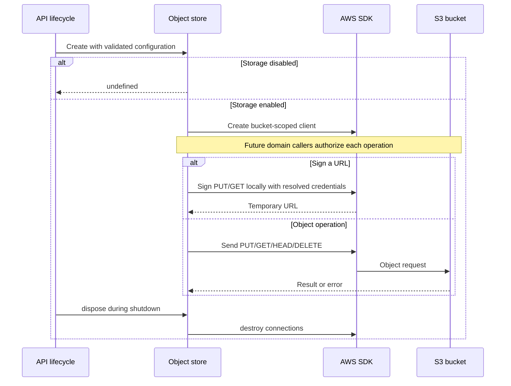

# Optional S3 object storage for the API

Status: proposed

## Decision

Add an optional, bucket-scoped S3 adapter to the API. Use the official AWS SDK selected in the earlier attachment work (#2636).
The adapter owns object transport and short-lived URL signatures. Domain services own keys, authorization, metadata, and upload completion rules.
The application owns one client and destroys its connections at shutdown. Missing configuration disables storage. Partial configuration fails startup.

## Scope

Support server uploads, streamed downloads, HEAD, deletion, and presigned PUT/GET URLs.
Support custom endpoints and optional path-style requests for services such as MinIO.
Use the AWS default credential chain, including standard AWS environment variables and IAM roles. Do not define separate S3 credential variables.
Use explicit region configuration when storage is enabled. Signed URLs have a fixed 900-second lifetime.

## Non-goals

This PR adds no public HTTP endpoints, attachment tables, cloud-sync protocol changes, or bucket provisioning.
It is independent of #2636. That PR can use this adapter in a later change.
Domain callers must authorize requests before signing URLs. Signed URLs are temporary bearer credentials and must not enter durable records or logs.

## Modules



```text
server/apps/api/
├── src/libs/env.ts                        # Validates startup configuration
├── src/services/adapters/s3-config.ts     # Owns S3 configuration rules
├── src/services/adapters/object-store.ts  # Owns object transport and signing
├── src/app.ts                            # Owns client lifetime
└── README.md                             # Documents deployment and callers
```

## Behavior



GET returns the SDK stream. Its caller must consume or destroy the stream to release the connection.
Storage errors propagate to domain callers. The adapter does not convert failed reads to empty objects.
Shutdown follows the existing application lifecycle. Callers must stop requests and consume streams before client disposal.
The adapter preserves object keys exactly and never derives them from untrusted HTTP paths.

## Test plan

- Validate disabled, complete, and incomplete configuration and endpoints.
- Verify signing through standard AWS environment credentials, including session tokens, with a fixed 900-second expiry.
- Exercise actual SDK signing with deterministic test credentials and verify signed headers and addressing modes.
- Exercise object requests through a local HTTP server and verify bytes, metadata, errors, and stream consumption.
- Exercise a disposable MinIO bucket, including direct uploads and rejection of changed signed headers.
- Run API typecheck, repository typecheck, and repository lint.
- Production credentials, bucket permissions, and browser CORS require deployment-specific verification.
