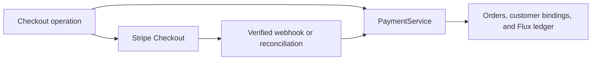
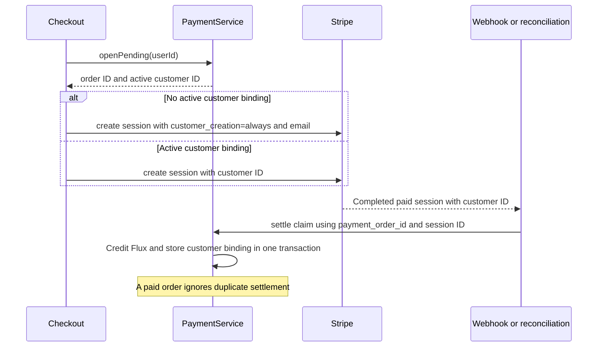

# Stripe Checkout customer creation

Status: accepted. The requester confirmed customer creation for unbound users and reuse for bound users.

## Decision

For users without an active Stripe customer binding, Checkout sends `customer_creation: 'always'` and the user email.
For users with a binding, Checkout sends the existing `customer` ID and omits the creation option and email.

Stripe defaults to conditional customer creation for one-time payments.
An email alone does not require a Customer object or select an existing Customer.
See the [Stripe Checkout parameters](https://docs.stripe.com/api/checkout/sessions/create#checkout_session_create-customer_creation).

Existing settlement stores the returned Customer ID in `payment_customer` when it credits the order.
The next checkout reads this binding through `PaymentService.openPending`.
Local orders already associate payments with users. Customer creation adds a persistent identity within Stripe.

## Scope and non-goals

This change updates Checkout parameters and regression coverage. It requires no database migration or HTTP contract change.
It does not backfill historical orders, save payment methods, change Flux grants, or deploy services.
Concurrent checkouts before the first binding can create multiple Stripe customers. This change does not serialize checkout creation.
Historical Stripe customers without a local binding are not matched by email.

## Dependencies and affected files



```text
server/
  apps/api/src/routes/stripe/operations/checkout.ts
  apps/api/src/routes/stripe/checkout.test.ts
  docs/ai/adr/2026-09-29-stripe-checkout-customer.md
```

## Payment sequence



## Test plan

- Require customer creation when no active binding exists, including a deleted binding.
- Settle a paid session through the existing receipt mapper and payment service.
- Verify the customer binding, Flux balance, and duplicate settlement behavior.
- Verify that the next checkout reuses the saved customer without creation or email parameters.
- Run the Stripe and payment tests, API typecheck, and repository lint.
- Mock Stripe at its SDK boundary. A real Stripe checkout remains outside automated test coverage.
