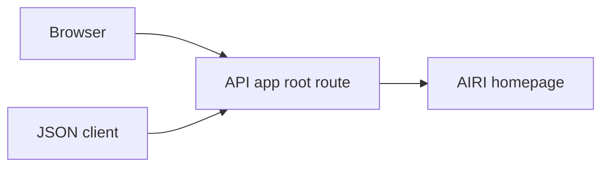
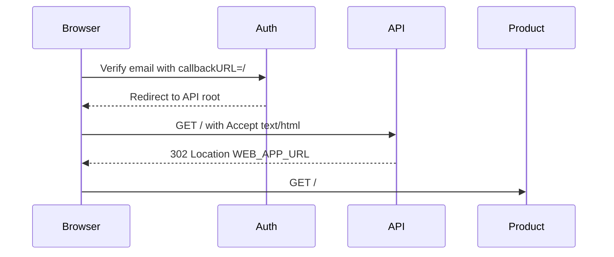

# API root browser redirect

Status: accepted

## Decision

Browser GET and HEAD requests to the API root redirect to the configured `WEB_APP_URL` with status 302.
The request must explicitly accept `text/html` with positive quality. Hono parses the media ranges; other clients retain the JSON service identity.
The response varies by `Accept`. The existing no-store policy remains active.
The target comes from server configuration, never from the request. Request queries are not forwarded.

## Scope

An email verification link with `callbackURL=/` returns the browser to the API root.
The current root returns JSON, leaving the user outside the product.
This change defines the API root as a product entry point for browser visitors.

Non-goals: email token handling, authentication callbacks, OIDC state, account mutations, and other API routes.
The redirect does not establish or confirm a login session or email verification status.

## Module dependencies



## Affected files

```text
server/apps/api/src/
  app.ts
  app.test.ts
```

## Sequence



## Test plan

Run the API app tests before and after the change.
Check GET and HEAD redirects, configured destinations without forwarded queries, JSON responses, unknown paths, POST requests, and health routes.
Run API typecheck, lint, and diff checks.
Production acceptance requires deployment and a fresh email verification flow.
