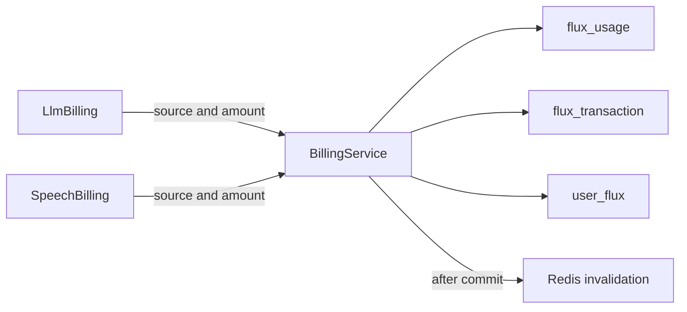
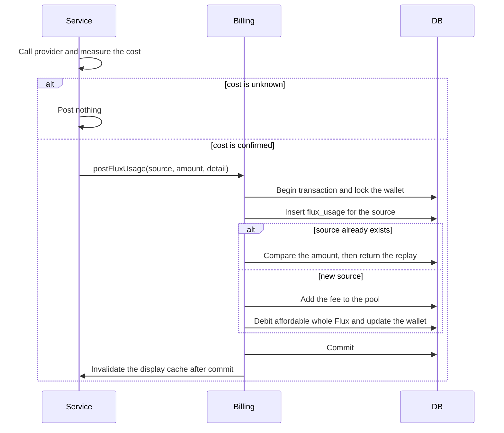

# Flux usage records and pooled settlement

Status: accepted

## Decision

The wallet accepts `postFluxUsage({ userId, source: { type, id }, amountMicroFlux, detail? })`.
The contract contains no model, turn, attempt, pricing, provider, or pending state.
`flux_usage` stores one confirmed micro-Flux fee for each source. Rows are append-only.
`flux_transaction` stores integer balance changes only. Its schema does not change.
`user_flux.unsettled_micro_flux` stores the shared outstanding pool.
One Flux equals 1,000,000 micro-Flux.
A service puts its own evidence in `detail`. A new service needs a new `source.type` and no new table.

## Boundary

```text
llm_request_attempt -> llm_request_log        evidence about what the provider did
                              |
                      (same request ID, no foreign key)
                              v
                         flux_usage           what this request cost in micro-Flux
                              |
                              v  (pooled settlement)
                       flux_transaction       integer balance changes
```

The request log keeps the provider cost and never converts it to Flux.
Billing converts a confirmed cost to micro-Flux with the price from the authorized policy.
Billing does not read the request log. The route gives it the usage in memory.
A failed log write cannot block billing. A failed billing write cannot block the log.

## Scope

Add `flux_usage` and `user_flux.unsettled_micro_flux`.
Stop writing `llm_request_settlement`.
Remove Redis speech character counters. Remove `FluxMeter`.
LLM and speech billing post through the same command.
Credits settle affordable outstanding fees. Admin adjustments preserve outstanding fees.

## Non-goals

Admission reservations, automatic reconciliation of unbilled requests, refunds, and historical repricing.

## Invariants

Source identity is unique per wallet, including zero amounts.
A duplicate source with a different amount fails. An identical replay never posts twice.
One transaction writes the usage record, the integer debit, and the wallet snapshot.
A debit reduces the pool by its integer amount times 1,000,000.
The sum of all fees equals debited Flux times 1,000,000 plus the outstanding pool.
Accounting does not depend on the request log. Replay reads only `flux_usage`.

## Unbilled requests

A cost that is unknown posts no fee. The request log keeps the evidence.
A request with a log row and no `flux_usage` row is unbilled.
Join the two tables on the request ID to find these requests.
The unknown cost is not priced later with the original price. Reconciliation uses the price at that time.

## Module graph



## Affected files

```text
server/apps/api/
  drizzle/0028_flux_usage.sql
  src/schemas/{flux,flux-usage}.ts
  src/services/domain/billing/{billing-service,flux-posting,llm-billing,speech-billing}.ts
  src/services/domain/{flux,flux-cache,flux-transaction}.ts
  src/routes/{flux,openai/v1,audio-speech-ws}/
  src/app.ts
```

## Posting sequence



## Migration and rollout

Migration 0028 creates `flux_usage` and adds `user_flux.unsettled_micro_flux`.
It does not change `flux_transaction` or `llm_request_settlement`. Historical rows stay as they are.
Migration 0030 drops `llm_request_settlement` and `llm_request_log.flux_consumed`.
The ledger column `flux_transaction.settlement_id` keeps its value. It no longer links to a row.
Export the historical settlements before migration 0030 runs. The drop cannot be reversed.
The request log no longer stores a Flux amount. The `flux_consumed` metric and span attribute report the fee in Flux.
The API applies the migration at startup.
Stop old API writers before the new version starts. Mixed old and new writers are unsupported.
Redis speech counters are not imported. The old meter forgave a residual of less than one Flux per user.
No production migration or deployment runs in this task.

## Verification

Run service tests and the full API test suite.
Run the concurrency test against a local PostgreSQL database with many connections and duplicate events.
Run the migration test with the actual SQL files. It checks that historical rows are unchanged.
Check the conservation invariant after mixed LLM, speech, credit, and admin operations.
Run the API typecheck and root lint.
